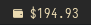
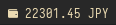
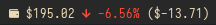
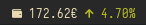
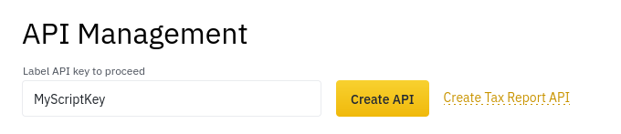
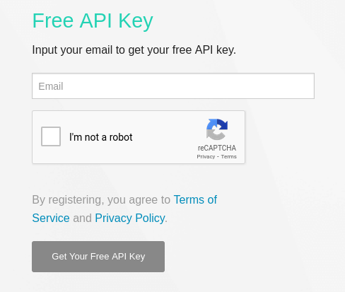
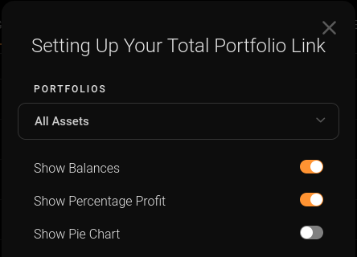

# Polybar Binance Portfolio Script

This simple script gives you an overview of your Binance Spot account balance with automatic currency rate adjustment for Polybar.



Adjusted by a non-USD currency rate:



There's also an experimental feature to scrap CoinStats shareable portfolio URL for in-depth profit/loss data. 

See [here](#CoinStats-Shareable-Portfolio-URL) for more information.





## Usage
```ini
[module/polybar-binance-portfolio]
type = custom/script
exec = ~/.config/polybar/modules/polybar-binance-portfolio.sh
interval = 600
```
Please remember to give your script execution permissions.

## Dependencies
This script requires `jq`, `curl`, `bc`, `grep`, `sed` and `openssl` to be installed and working correctly.

### Arch Linux
```
sudo pacman -S jq curl bc openssl
```
You can also optionally install Font Awesome 5 to use the icons shown in previews.
```
sudo pacman -S ttf-font-awesome
```

## Default Configuration
The configuration options are located in the script directly.
```bash
# Output format, this will be echoed to polybar.
# Available variables:
# - {CURRENCY}: Your selected FIAT currency.
# - {BALANCE}: The current portfolio balance adjusted for the selected currency.
# (You have to enable COINSTATS_USE to be able to use these variables)
# - {CS_USD_PRICE}: The current price of your selected currency in USD.
# - {CS_PNL_PERCENT}: The current profit/loss percentage of your portfolio.
# - {CS_PNL}: The current profit/loss of your portfolio adjusted for the selected currency.
# - {CS_PNL_ICON}: The current profit/loss icon.
# - {CS_PNL_DAILY_PERCENT}: The current profit/loss percentage of your portfolio in the last 24 hours.
# - {CS_PNL_DAILY}: The current profit/loss of your portfolio in the last 24 hours adjusted for the selected currency.
# - {CS_PNL_DAILY_ICON}: The current profit/loss icon in the last 24 hours.
FORMAT="\${BALANCE}"
# Example with CoinStats:
# FORMAT="\${BALANCE} {CS_PNL_DAILY_ICON} {CS_PNL_DAILY_PERCENT}%%{F-} (\${CS_PNL_DAILY})"

# An icon/label for {CS_PNL_ICON} or {CS_PNL_DAILY_ICON}.
ICON_UP="%{F#b8bb26}UP"
ICON_DOWN="%{F#fb4934}DOWN"

# Create an API key with at least a "Reading" permission.
# https://www.binance.com/my/settings/api-management
API_KEY=""
SECRET_KEY=""

# Please set your preferred currency here.
# Keep in mind that the currency converter API is not required for USD.
FIAT_CURRENCY="USD"

# You only need this if your FIAT_CURRENCY is not USD.
# https://www.currencyconverterapi.com/
CURRCONV_API_KEY=""

# !!! EXPERIMENTAL
# Use CoinStats scraper to get more data about your portfolio.
# This uses an UNOFFICIAL way to scrape data, so it's prone to breakage at ANY moment.
COINSTATS_USE=No # Set to Yes to enable.
COINSTATS_PORTFOLIO_URL="" 
```

## Requirements
Since this script uses a few different APIs to do it's job, you'll have to generate your own API keys.

### Binance API Key
Go to your [Binance API Management](https://www.binance.com/my/settings/api-management) dashboard to create a new API key.



And then copy your Public and Secret keys and paste them in the script here:
```bash
# Create an API key with at least a "Reading" permission.
# https://www.binance.com/my/settings/api-management
API_KEY="your public key"
SECRET_KEY="your secret key"
```

### Currency Converter API (optional)
You can skip this step if you want to use USD as your currency.

To generate your Free API Key you'll need to head to [CurrencyConverterAPI](https://free.currencyconverterapi.com/free-api-key) website.



Your API key will be sent to your email inbox. Remember to activate your account before using your key.

You can then copy and paste your key in the script:
```bash
# You only need this if your FIAT_CURRENCY is not USD.
# https://www.currencyconverterapi.com/
CURRCONV_API_KEY="your key"
```

### CoinStats Shareable Portfolio URL (optional)
You can opt-in to use the heavily experimental feature of the script to get in-depth profit/loss data from CoinStats.

Since CoinStats does not expose any API for PNL calculation, I had to look for another way. Thankfully, CoinStats allows it's users to create a "shareable portfolio link" that can be used to track your current portfolio balance (with detailed PNL information) publicly.

To create such a link, go into your [CoinStats Portfolio](https://coinstats.app/portfolio/) and select a small "link" icon at the bottom of the page.



And then just copy your link and paste it in the script:
```bash
# !!! EXPERIMENTAL
# Use CoinStats scraper to get more data about your portfolio.
# This uses an UNOFFICIAL way to scrape data, so it's prone to breakage at ANY moment.
COINSTATS_USE=Yes # Remember to set this to "Yes"
COINSTATS_PORTFOLIO_URL="your url" 
```
Please keep in mind that this is an EXPERIMENTAL feature and there's NO guarantee that it will work for you / at a later date.